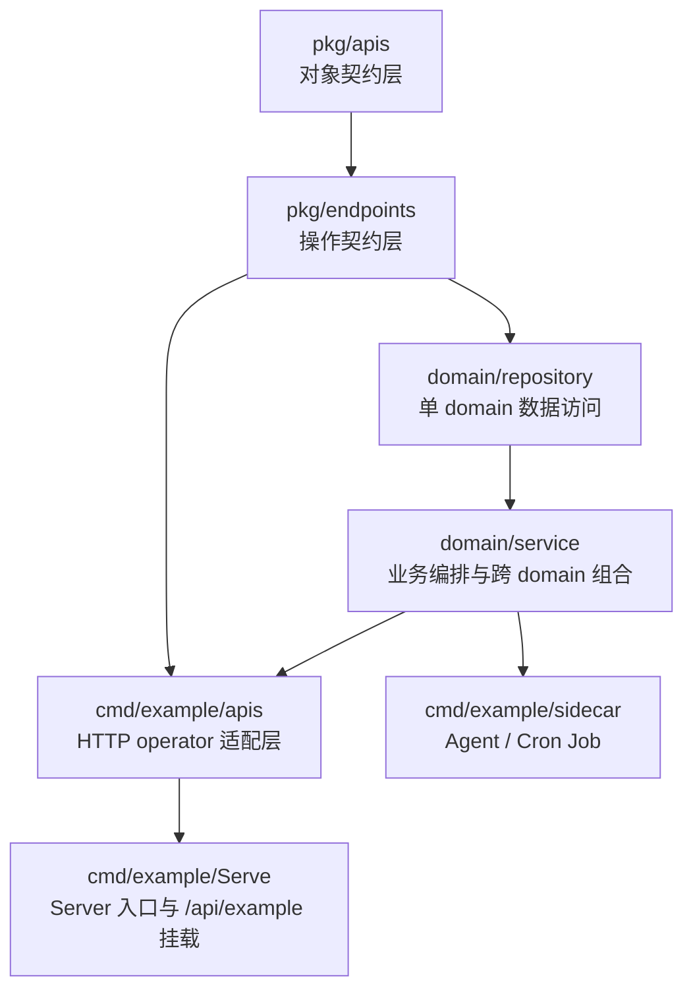

# internal/example

## Workspace 职责

`internal/example` 是一个完整的示例 workspace，用来演示如何在这套框架下，从稳定契约出发，逐层构建出可维护的业务实现与 HTTP API。

这套 workspace 分为四层：

1. `pkg/apis`
   定义业务对象本体、变体、引用、列表和业务错误。
2. `pkg/endpoints`
   定义 RESTful Operation 契约，包括 path、method、Operation 入参、返回体和错误集合。
3. `domain/*`
   基于契约实现数据库模型、转换、repository 和 service。
4. `cmd/example`
   提供 workspace 运行入口：
   - `Serve` 把 endpoint 与 service 组装成最终 HTTP API，统一挂到 `/api/example`
   - `sidecar` 承载后台 agent 和 cron job，例如定期关闭过期订单

## 上下游关系

- 上游依赖：仓库根 `pkg/object`、`pkg/apis/meta/v1`、`pkg/runtime` 和 `devpkg/objectkindgen` 提供对象契约、运行时能力与生成器注册。
- 下游消费者：`cmd/example` 产出的示例服务、示例 agent，以及仓库内用于回归生成链路的开发验证流程。

## Workspace 结构

```text
internal/example/
├── pkg/
│   ├── apis/              # 对象契约层
│   └── endpoints/         # 操作契约层
├── domain/
│   └── <domain>/
│       ├── {table}.go     # 数据库表 model
│       ├── convert/       # 表 model 与契约对象转换
│       ├── repository/    # 单 domain 数据访问
│       └── service/       # 业务编排、跨 domain 组合
└── cmd/example/
    ├── apis/              # HTTP API operator 适配层
    ├── sidecar/           # 后台 agent / cron job
    ├── main.go            # 示例程序入口
    └── serve.go           # Server 组装入口
```

## 软件分层示意图



分层职责：

- `pkg/apis` 回答“系统有哪些稳定业务对象和业务错误”
- `pkg/endpoints` 回答“系统提供哪些操作契约”
- `domain` 回答“这些契约如何落到数据与业务流程”
- `cmd/example/Serve` 回答“如何把契约和 service 组装成 HTTP API”
- `cmd/example/sidecar` 回答“如何把 service 组装成后台周期任务和治理任务”

## 核心原则

- 契约先行：先定义对象和操作，再落数据实现和 API 适配
- 边界稳定：service 不感知 HTTP，repository 不跨 domain
- 生成驱动：类型系统、operator、injectable、table、filterop 等通过生成器保持一致
- 面向维护：目录和声明方式既适合人维护，也适合 AI Agents 分段接手

## 完整构建流程

### 1. 定义对象契约

在 `pkg/apis/<domain>/v1` 定义业务对象及其相关类型。

推荐拆分方式：

- `product.go` / `order.go`
  定义主 objectkind
- `*_request.go`
  定义 create / update / action 变体
- `*_reference.go`
  定义资源引用
- `*_list.go`
  定义列表返回
- `errors.go`
  定义业务错误

约束：

- 主 objectkind 与 variant 分文件维护
- `ProductID`、`SkuCode`、`OrderCancelReason` 这类语义类型单独声明
- 错误放在版本目录内，作为 domain 的稳定业务语义

### 2. 定义操作契约

在 `pkg/endpoints/<domain>/v1` 定义每个 RESTful 场景对应的 Operation。

每个 Operation 需要明确：

- HTTP method
- path
- path/query/body 入参
- `ResponseData() *T`
- `ResponseErrors() []error`

约束：

- 列表、筛选、分页等输入直接定义到对应 Operation 上，更直观地表达完整调用契约
- `ResponseData()` 返回 `new(T)`
- 204 场景使用 `new(courierhttp.NoContent)`
- endpoint 不承载数据库或流程逻辑，只声明契约

### 3. 实现数据操作层

在 `domain/<domain>` 中基于契约实现数据操作层。

#### table model

`{table}.go` 定义数据库表模型、索引和约束。

#### convert

`convert/` 负责：

- 契约对象 -> 表 model
- 表 model -> 契约对象

#### repository

`repository/` 只做本 domain 的直接数据访问，例如：

- `Put...`
- `FindOne...`
- `List...`
- `Delete...`

这里不允许跨 domain 访问。

#### service

`service/` 负责：

- 业务动作编排
- 状态流转
- 跨 domain 读取与组合
- 后续可能接入 cache、内部 agent loop、批处理任务

这里不处理：

- auth
- rbac
- HTTP status
- transport 协议
- endpoint 细节

### 4. 组装 HTTP API

在 `cmd/example/apis/*` 中基于 endpoint 声明 operator。

推荐模式：

- 一个 operator 对应一个 endpoint
- operator embed endpoint 定义
- 通过 `inject:""` 注入 `*Service`
- `Output(ctx)` 中只做参数转发与最薄适配

例如：

```go
// +gengo:injectable
// +gengo:operator
type ListOrder struct {
	endpointorderv1.ListOrder

	orderService *orderservice.OrderService `inject:""`
}
```

这层是最终 HTTP API 的封装点，后续可以继续在这里追加：

- auth
- rbac
- middleware
- 审计
- 限流

而不影响 service。

### 5. 组装 Server

`cmd/example/Serve` 负责：

- 作为 CLI / server 入口
- 注入 `Database` 等基础设施依赖
- 在 server 初始化时挂载 `apis.R`
- 通过 infra 生命周期完成 singleton 初始化与 server 启动

当前示例 HTTP base path 为：

`/api/example`

### 6. 组装 Agent / Sidecar

`cmd/example/sidecar` 负责：

- 声明后台 agent
- 通过 `cron.Spec` 驱动周期任务
- 通过 inject 接入 `*Service`
- 只调用 service 能力，不直接承载业务规则和持久化细节

典型场景：

- 定期关闭过期未支付订单
- 定期修复状态
- 定期做清理或补偿任务

推荐模式：

- 一个 agent 只负责一类后台动作
- 默认通过 `Period` 控制调度
- 通过 `Disabled(ctx)` 控制是否启用
- 在 `afterInit(ctx)` 中注册 `Host(...)`

### 7. 程序入口

`cmd/example` 是 workspace 的总入口，统一承载：

- 对外 `Server`
- 后台 `Agent`
- 共享的 `Database`
- 共享的 `Service` provider

## 生成器

生成器统一在 `internal/cmd/devtool/main.go` 注册。

当前这套流程最关键的生成器有：

- `objectkindgen`
  生成 objectkind / variant 相关转换
- `uintstrgen`
  生成 ID / Code 等强类型包装
- `runtimedocgen`
  生成运行时文档描述
- `tablegen`
  生成表定义辅助代码
- `filteropgen`
  生成过滤操作
- `injectablegen`
  生成 `Init(ctx)`、`FromContext`、`InjectContext`
- `operatorgen`
  生成 operator 注册、`ResponseData()`、`ResponseErrors()`
- `clientgen`
  后续需要从契约生成 client 时使用

## 最小执行路径

当你新增或修改一个完整业务场景时，推荐顺序如下：

1. 在 `pkg/apis` 定义对象、变体、错误
2. 在 `pkg/endpoints` 定义 Operation
3. 运行 `go generate ./internal/example/pkg/apis/...`
4. 在 `domain/*` 实现 table、convert、repository、service
5. 运行 `go generate ./internal/example/domain/...`
6. 在 `cmd/example/apis/*` 基于 endpoint 声明 operator
7. 在 `cmd/example/sidecar/*` 定义后台 agent 或 cron job
8. 运行 `go generate ./internal/example/cmd/example/...`
9. 执行测试与构建验证

## 最小验证路径

推荐按下面顺序验证：

1. `go test ./internal/example/domain/product/repository ./internal/example/domain/order/repository`
2. `go test ./internal/example/domain/product/service ./internal/example/domain/order/service`
3. `go test ./internal/example/cmd/example/...`
4. `go test ./internal/example/cmd/example/sidecar/...`

验证重点：

- repository 先证明单 domain 数据行为正确
- service 再证明业务流程、状态流转、错误传播正确
- `cmd/example/Serve` 证明 HTTP 组装层能正常编译和挂载
- `cmd/example/sidecar` 证明后台治理任务能正常注入、调度并调用 service

## 关键影响点

以下变更会跨层传播，需要连锁检查：

- `pkg/apis` 的对象字段、ID/Code 类型、错误类型变更
- `pkg/endpoints` 的 path、body、response、errors 变更
- `domain/convert` 的字段映射变更
- `service` 的业务状态机变更
- `cmd/example/apis/*` 的 operator 声明变更
- `cmd/example/sidecar/*` 的 agent 调度与 service 调用变更

只要上游契约变化，就要同步检查下游生成物与实现是否仍一致。

## 为什么这样组织

这套结构的价值不只是“分层清楚”，而是它让不同层的上下文足够稳定：

- 契约层回答“系统对外提供什么”
- domain 层回答“业务如何落地”
- Server 层回答“HTTP 如何承接这些能力”
- Agent 层回答“后台任务如何复用 service 做持续治理”
- API 适配层回答“HTTP 如何承接这些能力”

这样一来，不管是人协作，还是 AI Agents 分层处理任务，都可以在清晰边界内修改，不容易互相污染。
